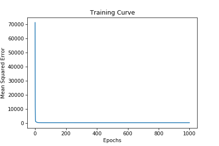

Material Science Usecase: Local Filesystem (Windows)
========================================

.. raw:: html

    
    

.. role:: indexred
.. role:: red

.. toctree::
   :maxdepth: 2
   
The capabilities of :red:`ObjectDataStorage` can also be applied to the datasets that reside on the local filesystems. 

Install the ``osds`` package to retrieve data using ``ObjectStorageDataset`` class.

.. testcode::

	!pip install osds

To access datasets from local filesystem using ``ObjectStorageDataset``, we specify the glob starting with ``file://``.
	
`Concrete Compressive Strength Dataset <https://archive.ics.uci.edu/ml/datasets/concrete+compressive+strength>`_ is used to build a simple linear regression model on the data retrived using OSDS.

The dataset consists of 9 quantitative attributes of which 7 attributes explain the ingredients, 1 attribute provides information about age, and the last attribute is the output, concrete compressive strength, which is a highly nonlinear function of age and ingredients.

The attributes follow the naming pattern of Name - DataType - Measurement - Description. The first 8 attributes are considered as input variables and the last attribute is considered to be the output variable.

Datasets from local filesystem are by default pre-loaded into the cache if the data fits in the cluster memory when no argument is specified to ``eager_load_batches``. Another way to preload partitions from object storage to memory is by setting ``eager_load_batches=True``.

.. testcode::

	from osds.utils import ObjectStorageDataset
	from torch.utils.data import DataLoader
	
	batch_size = 10
	concrete_data_ds = ObjectStorageDataset(glob="file://C:\\Users\\dilee\\osds\\data\\ccs_dataset\\concrete_data.csv", 
						batch_size=batch_size,
						eager_load_batches=False)
	
Create an iterable object of the concrete_data_ds ``osds.utils.ObjectStorageDataset``, followed by calling **next()** method on the iterable to iterate over the whole dataset in batches.

.. testcode::

	concrete_data_iter = iter(DataLoader(concrete_data_ds, batch_size=None))
	batch = next(concrete_data_iter)
	
	type(batch)
	>> torch.Tensor
	
	batch.shape
	>> torch.Size([10, 9])
	
The type of the batch is :red:`torch.Tensor`. The specified batch_size is **10**, and the number of columns in the dataset are **9**. So, the shape of each batch would be **[10,9]**.	

	
We now create a ``LinearRegressionModel`` class using ``torch.nn.Module``, and will train a regression model on the dataset.

.. testcode::

	import torch
	class LinearRegressionModel(torch.nn.Module):
		def __init__(self, input_size, output_size):
			super(LinearRegressionModel, self).__init__()
			self.linear = torch.nn.Linear(input_size, output_size)
		
		def forward(self, X):
			return self.linear(X)
			
Retrieve the dataset size and the input size by the following commands. The dataset is also split into target and features while training the model and in this case, we have 1 target and 8 features. Hence, the shape of the features and target upon data split would be [10,8] and [10] respectively.

.. testcode::

	concrete_dataset_size = len(concrete_data_ds.df.index)
	input_size = len(concrete_data_ds.df.columns[:-1])
	
Now instantiate the **LinearRegressionModel** class, loss function and the optimizer to train the model.

.. testcode::

	torch.maunal_seed(50)
	model = LinearRegressionModel(input_size, output_size=1).double()
	loss_fn = torch.nn.MSELoss(reduction='Mean')
	LEARNING_RATE = 1e-03
	optimizer = torch.optim.Adam(model_parameters(), lr=LEARNING_RATE)

For each epoch of training the model, we use the whole dataset but only accessing in batches, i.e., we iterate once through the whole dataset for 1 epoch. The following code will train the LinearRegressionModel.

.. testcode::

	losses = []
	N_EPOCHS = 1000
	for epoch in range(N_EPOCHS):
		running_loss = 0.
		for i in range(int(concrete_dataset_size/batch_size)):
			batch = next(concrete_data_iter)
			features, target = batch[:,:,:8], batch[:,:,8]
			
			yhat = model(features).view(-1, batch_size)
			loss = loss_fn(yhat, target)
			loss.backward()

			optimizer.step()
			optimizer.zero_grad()

			running_loss += loss.item()
			
			#Print the loss for every one iteration through the whole dataset and for every 100 epochs.
			if i%int(concrete_dataset_size/batch_size) == int(concrete_dataset_size/batch_size)-1:
				losses.append(running_loss/ int(concrete_dataset_size/batch_size))
				if epoch%100 == 99:
					print('[%d, %5d] \t loss: %.3f' %(epoch + 1, i + 1, running_loss / int(concrete_data_size/batch_size)))
			

The training curve of the model can be plotted by the following code and the curve can be seen in the image down below.

.. testcode::

	plt.subplots(dpi=75)
	plt.plot(range(N_EPOCHS), losses)
	plt.xlabel("Epochs")
	plt.ylabel("Mean Squared Error")
	plt.title("Training Curve")
	
